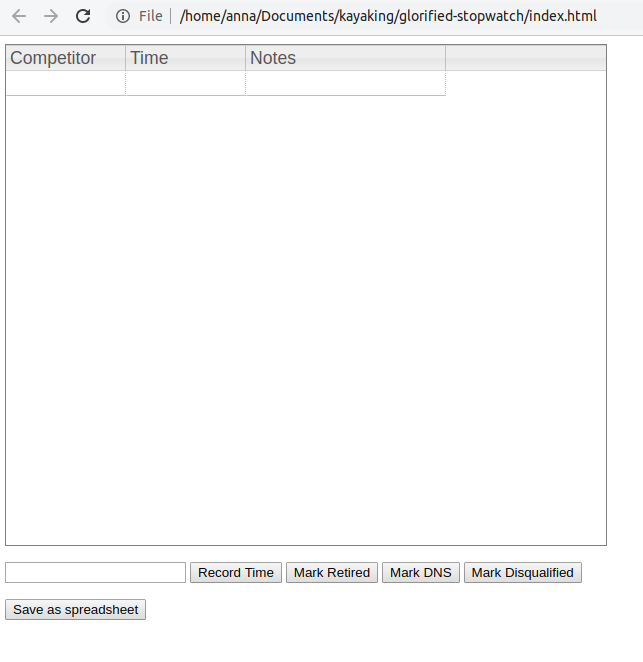
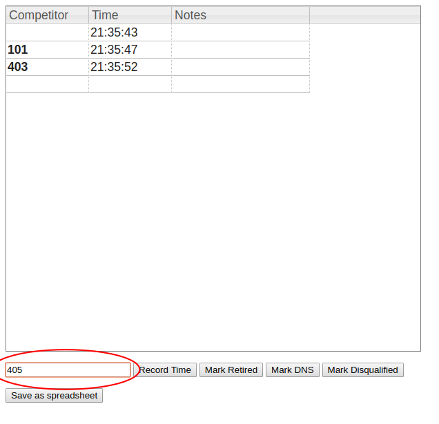
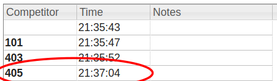

# glorified-stopwatch

This is a basic web-based application for timing races. 

No internet connection is needed to run the tool. 

## Installation

1. Go to [releases](https://github.com/smowton/glorified-stopwatch/releases/latest)
2. Download `gs-release-X.zip` (where `X` is the release number)
3. Unzip the file somewhere sensible
4. Open `index.html` in the browser of your choice (tested for Chrome and Firefox)
5. You should see the following:



## Usage

* Hit enter to see a time appear in the table (this is your computer's system time)
* Entering a competitor number (or name) in the box at the bottom and hitting enter (or clicking `Record time`) will cause a time to be recorded against them:


* You can also mark competitors as retired, DNS or DQed
* The table is fully editable - double click on a cell to see! Useful if you just need to record times then fill in the competitor numbers later.
* Download the table as a `.csv` file for reading by Excel, LibreOffice etc. by clicking `Save as spreadsheet`. This will download `results.csv` to your default downloads folder.
* You will get warned if you try to leave the page - data will be lost if you close the tab without saving the spreadsheet!

## Bugs / feature requests

Please open an [issue](https://github.com/smowton/glorified-stopwatch/issues) if you find any bugs or can think of any improvements. We also welcome PRs for the latter! 

## Why isn't this in Excel? 

We didn't have an Microsoft Office license and didn't fancy buying one! This way is also operating system agnostic as you just need an internet browser to run it. 

## Hacking about / contributing

Submodules are unfortunately involved in downloading the code:
```
git clone https://github.com/smowton/glorified-stopwatch.git
git submodule update --init
````